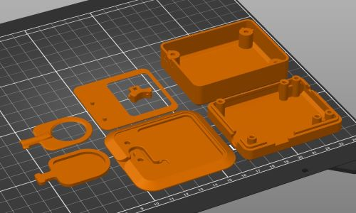

# 3D Print Files
| File                               | QTY | Resolution | Infill | Support |
|------------------------------------|-----|------------|--------|---------|
| RTS_Circular_Touch_Pad_Base        | 1   | 0.2 mm     | 20%    | No      |
| RTS_Circular_Touch_Pad_Top         | 1   | 0.2 mm     | 20%    | No      |
| RTS_Hub_Base                       | 1   | 0.2 mm     | 20%    | No      |
| RTS_Hub_Switch_Slider              | 1   | 0.2 mm     | 20%    | No      |
| RTS_Hub_Top                        | 1   | 0.2 mm     | 20%    | No      |
| RTS_RectangularPad_Base            | 1   | 0.2 mm     | 20%    | No      |
| RTS_RectangularPad_Top             | 1   | 0.2 mm     | 20%    | No      |

